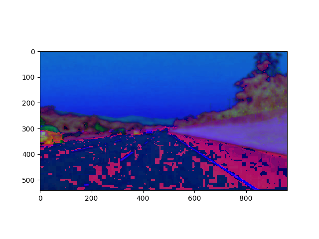
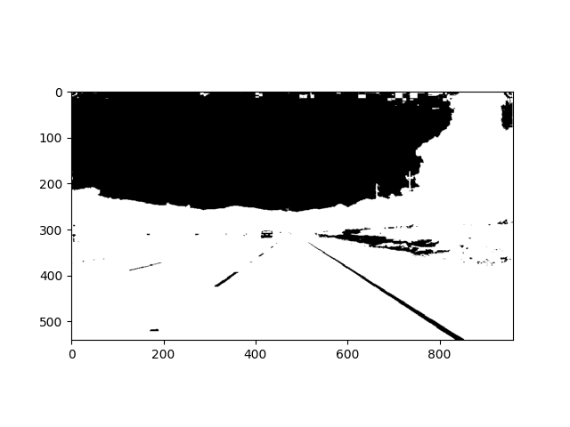
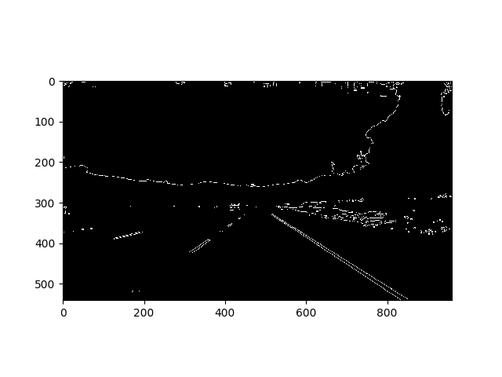
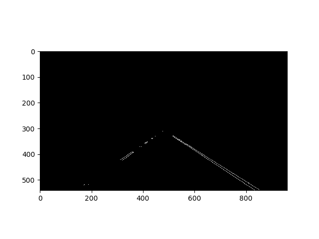
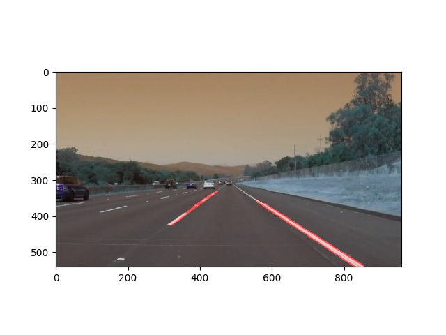
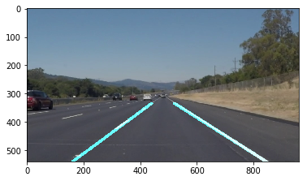

#**Finding Lane Lines on the Road**

Overview
---

When we drive, we use our eyes to decide where to go.  The lines on the road that show us where the lanes are act as our constant reference for where to steer the vehicle.  Naturally, one of the first things we would like to do in developing a self-driving car is to automatically detect lane lines using an algorithm.

In this project you will detect lane lines in images using Python and OpenCV.  OpenCV means "Open-Source Computer Vision", which is a package that has many useful tools for analyzing images.  

To complete the project, two files will be submitted: a file containing project code and a file containing a brief write up explaining your solution. We have included template files to be used both for the [code](https://github.com/udacity/CarND-LaneLines-P1/blob/master/P1.ipynb) and the [writeup](https://github.com/udacity/CarND-LaneLines-P1/blob/master/writeup_template.md).The code file is called P1.ipynb and the writeup template is writeup_template.md

To meet specifications in the project, take a look at the requirements in the [project rubric](https://review.udacity.com/#!/rubrics/322/view)

The pipeline
---

First the image is converted to hsv

Then filtered it with white only

Applied gaussian blur

Applied canny edge detection

Defined region of interest

Setup hough lines & laid them over initial image

Extrapolated lines in draw_lines

  This took the majority of time and is more detailed. You can see the full design of the program in the `draw_lines` function.

  1. got the slope and length of each line
  2. separated lines into right and left based on slope being negative or positive
  3. if slope was between 0.4 and -0.4, meaning too shallow, the line was discarded
  4. if the slope's absolute value was greater than 0.9 it was also discarded
  5. added x's and y's and slopes and lengths to it's own list
  6. calculated a weighted slope based on the length of the line
  7. calculated the change in percentage of the previous slope with current slop
  8. if previous slope was great than 1.5 percent for either lane, it was discarded
  9. then took the remaining x's in the right and left lane and ran a polynomial fit
  10. then averaged out the current x's with the previous x's so the transition is smoother
  11. then showed the line
  12. if any of the parameters failed, the previously cached line was shown

Here is what the end result looked like:

Potential shortcomings
---

- it will definitely not work with the challenge currently
- it does not work for rain and dust
- it does not work well with curved roads
- it does not work so well when there are a lot of different color marked lanes
- it does not work when there are no lanes in the road (dirt road, etc.)
- it does not work well on hills or any sort of severe vertical curverature
- it does not work well at night (it's dark)
- it does not work well when light is shining right at the vehicle
- it does not work well when other vehicles, cars, bikes, people are covering the lanes.

Possible improvements for the future
---

- general refactoring, and better code
- use EKF or particle filtering
- use RANSAC to make better guesses of lane lines
- multi-dimensional poly fit for curved lines, currently only linear approx.
- find better hough line parameters
- use IR camera for night time lane detection
- use multiple cameras to get a better sense of where the lanes are
