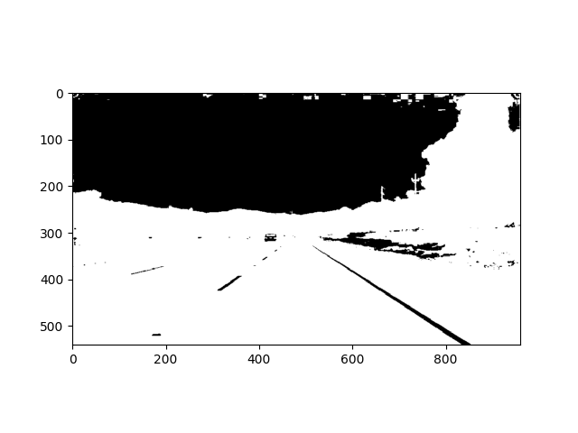
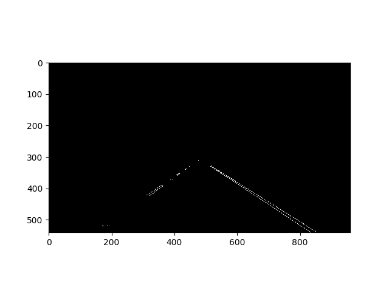

## 1. Describe your pipeline

1. turned image to hsv

2. filtered it with white only

3. applied gaussian blur

4. applied canny edge detection

5. defined region of interest

6. setup hough lines & laid them over

7. extrapolated lines in draw_lines

    8. got the slope and length of each line
    9. separated lines into right and left based on slope being negative or positive
    10. if slope was between 0.4 and -0.4, meaning too shallow, the line was discarded
    11. if the slope's absolute value was greater than 0.9 it was also discarded
    12. added x's and y's and slopes and lengths to it's own list
    13. calculated a weighted slope based on the length of the line
    14. calculated the change in percentage of the previous slope with current slop
    15. if previous slope was great than 1.5 percent for either lane, it was discarded
    16. then took the remaining x's in the right and left lane and ran a polynomial fit
    17. then averaged out the current x's with the previous x's so the transition is smoother
    18. then showed the line
    19. if any of the parameters failed, the previously cached line was shown

    

## 2. Identify potential shortcomings

- it will definitely not work with the challenge currently
- it does not work for rain and dust
- it does not work well with curved roads
- it does not work so well when there are a lot of different color marked lanes
- it does not work when there are no lanes in the road (dirt road, etc.)
- it does not work well on hills or any sort of severe vertical curverature
- it does not work well at night (it's dark)
- it does not work well when light is shining right at the vehicle
- it does not work well when other vehicles, cars, bikes, people are covering the lanes.

## 3. Possible improvements

- use EKF or particle filtering instead
- use RANSAC to make better guesses of lane lines
- multi-dimensional poly fit for curved lines, currently only linear approx.
- find better hough line parameters
- use IR camera for night time lane detection
- use multiple cameras to get a better sense of where the lanes are
